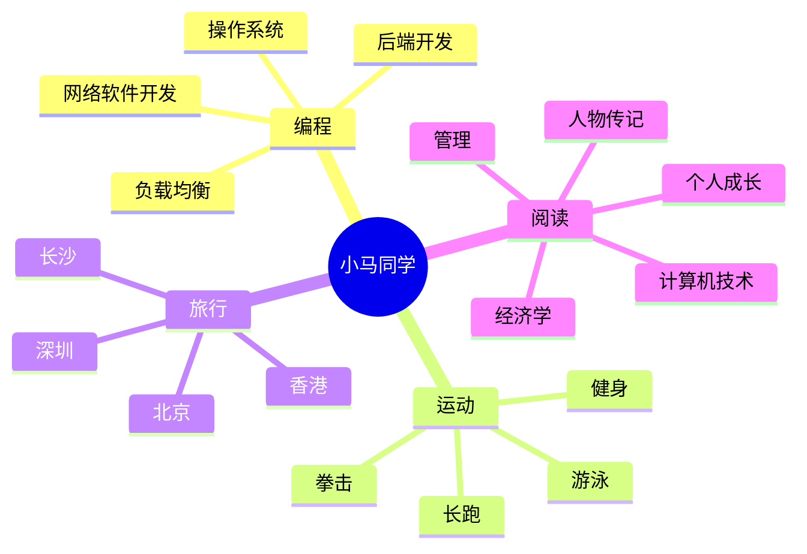

<div align="center">
  
  <!-- dynamic typing effect 动态打字效果 -->
  <div align="center">
    <a href="https://blog.sunguoqi.com/">
      
    </a>
  </div>

  <!-- knock code pictures 敲代码的图片 -->
  <br>

  <!-- profile logo 个人资料徽标 -->
  <div align="center">
    <a href="https://twitter.com/xmg2023/"></a>&emsp;
    <a href="https://www.youtube.com/@xmg2023"></a>&emsp;
    <a href="https://space.bilibili.com/315558537/"></a>&emsp;
    <a href="https://blog.csdn.net/u013146882/"></a>&emsp;
    <a href="https://www.zhihu.com/people/xmg91/"></a>&emsp;
    <!-- visitor statistics logo 访客数统计徽标 -->
    
  </div>
</div>

#  🙋 Hello

<tr><td>

<!-- About me 关于我 -->
### 🤺 About Me
  
<p>&emsp;&emsp;大家好，我是小马同学。</p>
<p>&emsp;&emsp;热爱编程、电影、读书、旅行。</p>
<p>&emsp;&emsp;热爱计算机科学和互联网事业，励志成为优秀的开源开发者。</p>
<p>&emsp;&emsp;我们正在让这个世界变得更加美好，通过代码来理解世界和改变世界。</p>

</td></tr>

<tr><td>

<!-- 近期博客 -->
### 📃 Recent Blog
  
<!-- START_SECTION:blog -->
* <a href='https://blog.csdn.net/u013146882/article/details/79265924' target='_blank'>JData数据处理及高潜用户购买意向预测 </a> - 2018-02-05
* <a href='https://blog.csdn.net/u013146882/article/details/77685123' target='_blank'>srand()和rand() </a> - 2017-08-29
<!-- END_SECTION:blog -->

</td></tr>

<tr><td>

### 🤾‍♂️ Funny Soul

<!-- START_SECTION:douban -->
* <a href='https://book.douban.com/subject/5403729/' target='_blank'>最近在读三国志</a> 🌟🌟🌟🌟🌟 力荐- 2023-06-10
* <a href='https://book.douban.com/subject/36094930/' target='_blank'>看过史记</a> 🌟🌟🌟🌟🌟 力荐- 2023-06-01
* <a href='https://book.douban.com/subject/26642310/' target='_blank'>看过DOOM启示录</a> 🌟🌟🌟🌟🌟 力荐- 2022-10-07
<!-- END_SECTION:douban -->

</td></tr>

<tr><td>

<!-- wakatime 统计 -->
### 📊 WakaTime

<a href="https://wakatime.com/@e8e9f94a-c6d5-4359-ad10-7569a08bae41"></a>&emsp;

<!--START_SECTION:waka-->
**I'm a Night 🦉** 

```text
🌞 Morning                214 commits         █████░░░░░░░░░░░░░░░░░░░░   18.06 % 
🌆 Daytime                319 commits         ███████░░░░░░░░░░░░░░░░░░   26.92 % 
🌃 Evening                479 commits         ██████████░░░░░░░░░░░░░░░   40.42 % 
🌙 Night                  173 commits         ████░░░░░░░░░░░░░░░░░░░░░   14.60 % 
```
📅 **I'm Most Productive on Friday** 

```text
Monday                   200 commits         ████░░░░░░░░░░░░░░░░░░░░░   16.88 % 
Tuesday                  161 commits         ███░░░░░░░░░░░░░░░░░░░░░░   13.59 % 
Wednesday                128 commits         ███░░░░░░░░░░░░░░░░░░░░░░   10.80 % 
Thursday                 105 commits         ██░░░░░░░░░░░░░░░░░░░░░░░   08.86 % 
Friday                   315 commits         ███████░░░░░░░░░░░░░░░░░░   26.58 % 
Saturday                 142 commits         ███░░░░░░░░░░░░░░░░░░░░░░   11.98 % 
Sunday                   134 commits         ███░░░░░░░░░░░░░░░░░░░░░░   11.31 % 
```


📊 **This Week I Spent My Time On** 

```text
🕑︎ Time Zone: Asia/Shanghai

💬 Programming Languages: 
TypeScript               45 mins             ███████████░░░░░░░░░░░░░░   42.59 % 
JSON                     40 mins             █████████░░░░░░░░░░░░░░░░   37.99 % 
Vue.js                   9 mins              ██░░░░░░░░░░░░░░░░░░░░░░░   08.47 % 
SCSS                     3 mins              █░░░░░░░░░░░░░░░░░░░░░░░░   03.39 % 
CSS                      3 mins              █░░░░░░░░░░░░░░░░░░░░░░░░   03.15 % 

🔥 Editors: 
VS Code                  1 hr 46 mins        █████████████████████████   100.00 % 

💻 Operating System: 
Windows                  1 hr 46 mins        █████████████████████████   100.00 % 
```


 Last Updated on 10/06/2023 01:38:52 UTC
<!--END_SECTION:waka-->
  
</td></tr>
</table>

<div align="center" >



  
<!--  skill badge 技能徽章 -->
💪 正在学习
  


  
🧠 计划学习
  


🧰 常用的工具


<div align="center" >
  
<!-- GitHub 奖杯🏆 -->
<br>

<div align="center">

<!-- github-readme-streak-stats 连续提交代码天数记录 -->


<!-- GitHub Activity Graph GitHub 活动图 -->
<div align="center">  </div>

</div>
